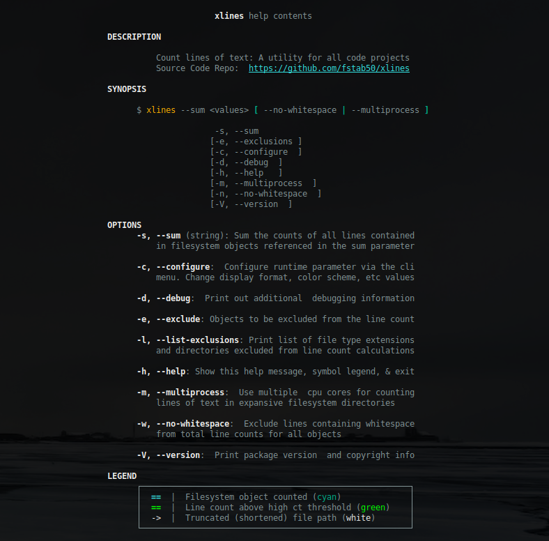
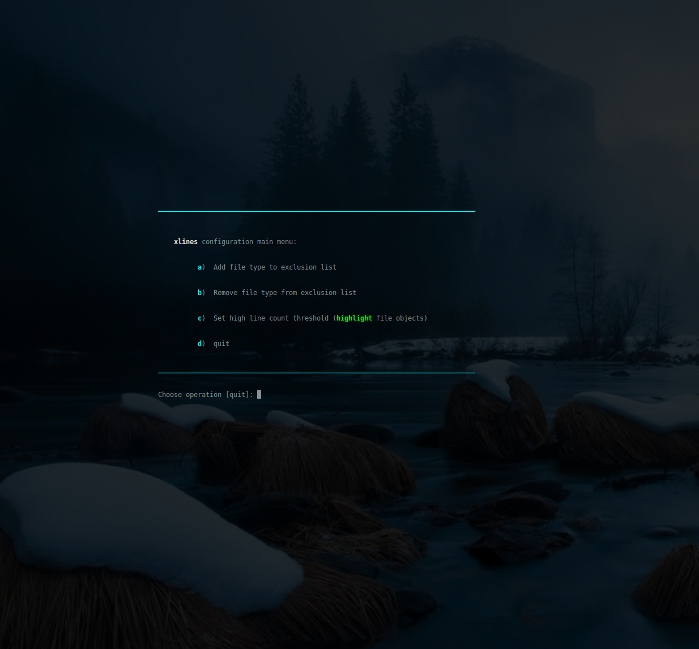
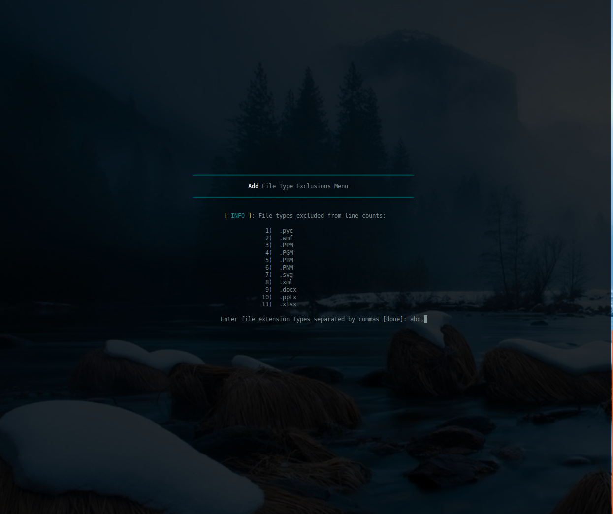
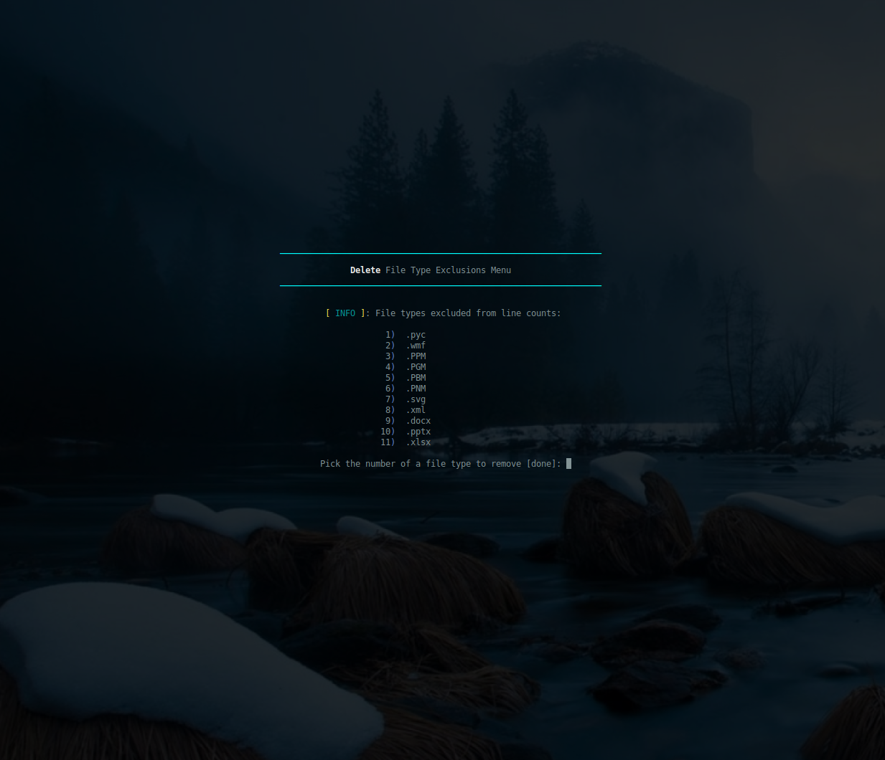
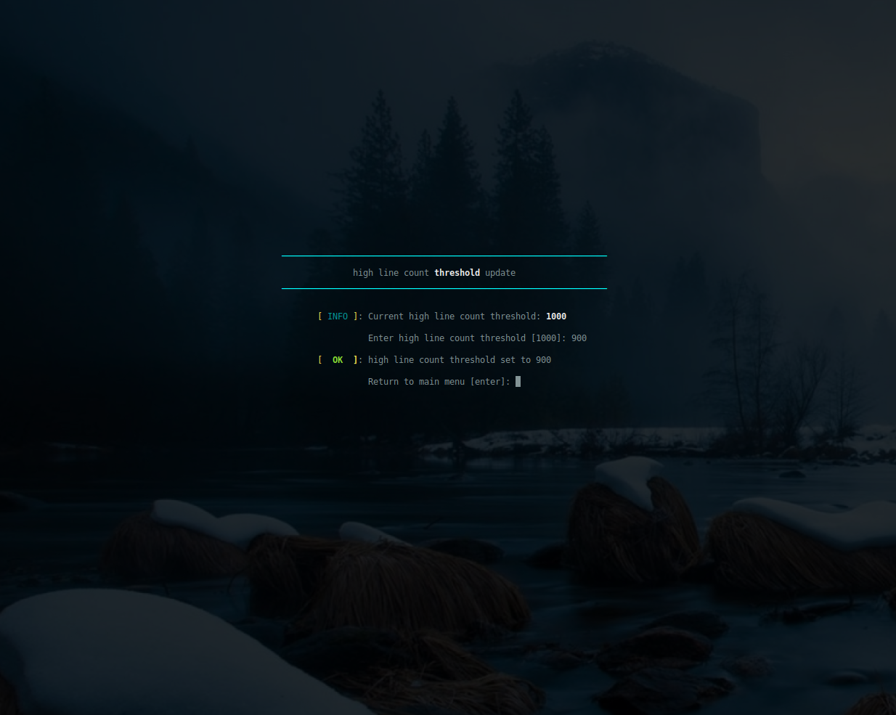
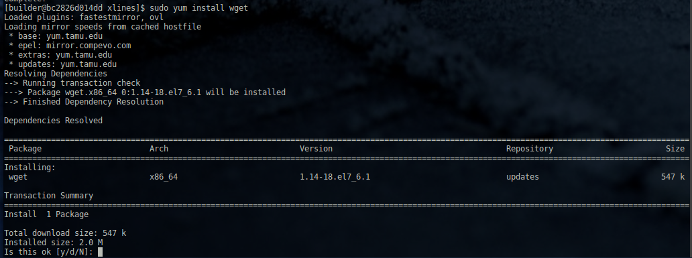
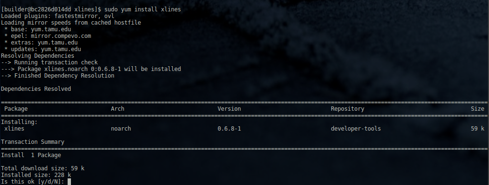
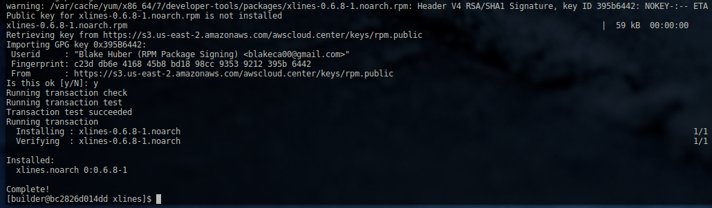
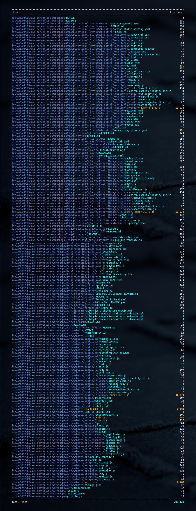
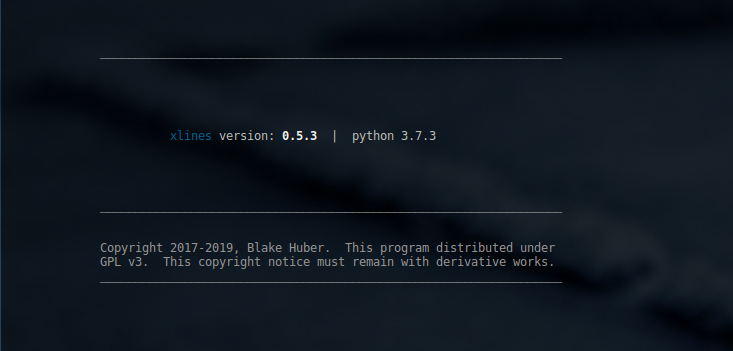

<a name="top"></a>
* * *
# xlines
* * *

## Summary

Count the number of lines of text in a code project (or anything else)

**Version**: 0.7.1

* * *

## Contents

* [**Dependencies**](#dependencies)

* [**Options**](#options)

* [**Configuration**](#configuration)

* [**Exclusions**](#exclusions)

* [**INSTALLATION**](#installation)
    * [Pip Install](#installation)
    * [Ubuntu, Linux Mint, Debian-based Distributions](#debian-distro-install)
    * [Redhat, CentOS, Fedora, Amazon Linux](#redhat-distro-install)

* [**Screenshots**](#screenshots)

* [**Author & Copyright**](#author--copyright)

* [**License**](#license)

* [**Disclaimer**](#disclaimer)

--

[back to the top](#top)

* * *

## Dependencies

[xlines](https://github.com/fstab50/xlines) requires python3.6+


[back to the top](#top)

* * *

## Options

To display the help menu:

```bash
    $ xlines --help
```

[](http://images.awspros.world/xlines/help-menu.png)


[back to the top](#top)

* * *
## Configuration

[xlines](https://github.com/fstab50/xlines) runtime optinos may be configured by entering the configuration menu:

```bash
    $ xlines --configure
```

[](http://images.awspros.world/xlines/configure_toc.png)


Option "A" (shown below) allows addition of file types to be excluded (skipped) from line totals

[](http://images.awspros.world/xlines/configure_a.png)


Option "B" (shown below) allows deletion of file types to be excluded so that a specific type of file can again be included in total line counts:

[](http://images.awspros.world/xlines/configure_b.png)


Option "C" (shown below) allows user-customization of files highlighted for containing a large number of lines of text:

[](http://images.awspros.world/xlines/configure_c.png)


--

[back to the top](#top)

* * *
## Installation
* * *

### Pip Install

xlines may be installed on Linux via [pip, python package installer](https://pypi.org/project/pip) in one of two methods:

To install xlines for a single user:

```
$  pip3 install xlines --user
```

To install xlines for all users (Linux):

```
$  sudo -H pip3 install xlines
```

[back to the top](#top)

* * *
<a name="debian-distro-install"></a>
### Ubuntu, Linux Mint, Debian variants

xlines is not yet offered in native Debian Linux package format.


[back to the top](#top)

* * *
<a name="redhat-distro-install"></a>
### Redhat, CentOS, Fedora

The easiest way to install **xlines** on redhat-based Linux distributions is via the developer-tools package repository:


1. Install the official epel package repository

    ```
    $ sudo yum install epel-release
    ```

2. Download and install the repo definition file

    ```
    $ sudo yum install wget
    ```

    [](http://images.awspros.world/xlines/rpm-install-1.png)

    ```
    $ wget http://awscloud.center/rpm/developer-tools.repo
    ```

    [](http://images.awspros.world/xlines/rpm-install-2.png)

    ```
    $ sudo chown 0:0 developer-tools.repo && sudo mv developer-tools.repo /etc/yum.repos.d/  
    ```

3. Update local repository cache

    ```
    $ sudo yum update -y
    ```


4. Install **xlines** os package

    ```
    $ sudo yum install xlines
    ```

    [](http://images.awspros.world/xlines/rpm-install-3.png)


    Answer "y":

    [](http://images.awspros.world/xlines/rpm-install-4.png)


5. Verify Installation

    ```
    $ yum info xlines
    ```

    [](http://images.awspros.world/xlines/rpm-install-5.png)

--

[back to the top](#top)

* * *
## Screenshots

Counting lines in large repository with long paths.

```bash
    $ xlines  --sum  git/AWSAMPLES/aws-serverless-workshops/
```

[](http://images.awspros.world/xlines/repofinal.png)


[back to the top](#top)

* * *

## Author & Copyright

All works contained herein copyrighted via below author unless work is explicitly noted by an alternate author.

* Copyright Blake Huber, All Rights Reserved.

[back to the top](#top)

* * *

## License

* Software contained in this repo is licensed under the [license agreement](./LICENSE.md).  You may display the license and copyright information by issuing the following command:

```
$ xlines --version
```

[](https://s3.us-east-2.amazonaws.com/http-imagestore/xlines/version-copyright.png)


[back to the top](#top)

* * *

## Disclaimer

*Code is provided "as is". No liability is assumed by either the code's originating author nor this repo's owner for their use at AWS or any other facility. Furthermore, running function code at AWS may incur monetary charges; in some cases, charges may be substantial. Charges are the sole responsibility of the account holder executing code obtained from this library.*

Additional terms may be found in the complete [license agreement](./LICENSE.md).

[back to the top](#top)

* * *
