<a name="top"></a>
* * *
# xlines
* * *

## Summary

Count the number of lines of text in a code project (or anything else)

**Version**: 0.7.17

* * *

## Contents

* [**Dependencies**](#dependencies)

* [**Program Options**](#program-options)

* [**Build Options**](#build-options)

* [**Configuration**](#configuration)

* [**Exclusions**](#exclusions)

* [**Installation**](#installation)
    * [Pip Install](#installation)
    * [Ubuntu, Linux Mint, Debian-based Distributions](#debian-distro-install)
    * [Redhat, CentOS](#redhat-distro-install)
    * [Amazon Linux 2, Fedora](#amzn2-distro-install)

* [**Screenshots**](#screenshots)

* [**Author & Copyright**](#author--copyright)

* [**License**](#license)

* [**Disclaimer**](#disclaimer)

--

[back to the top](#top)

* * *

## Dependencies

[xlines](https://github.com/fstab50/xlines) requires [Python 3.6+](https://docs.python.org/3/).

If your environment has Python 3.5 or older or is missing Python 3 altogether, consider using <a href="https://github.com/fstab50/nlines" target="_blank">nlines</a> as an excellent alternative. nlines [bash](https://www.gnu.org/software/bash) implementation line counter is compatible with virtually any Linux-based development environment.


[back to the top](#top)

* * *

## Program Options

To display the **xlines** help menu:

```bash
    $ xlines --help
```

<p align="center">
    <a href="http://images.awspros.world/xlines/help-menu.png" target="_blank">
</p>

--

[back to the top](#top)

* * *
## Build options

**[GNU Make](https://www.gnu.org/software/make) Targets**.  Type the following to display the available make targets from the root of the project:

```bash
    $  make help
```

<p align="center">
    <a href="http://images.awspros.world/xlines/make-help.png" target="_blank">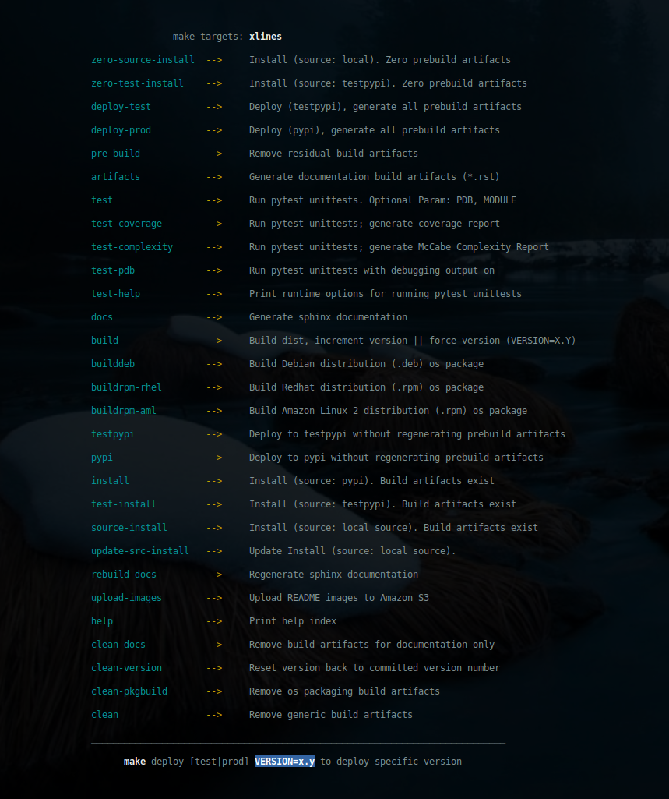
</p>

--

[back to the top](#top)

* * *
## Configuration

Configure [xlines](https://github.com/fstab50/xlines) runtime options by entering the configuration menu:

```bash
    $ xlines --configure
```

[](http://images.awspros.world/xlines/configure_toc.png)&nbsp;

[back to the top](#top)

--

Option "A" (shown below) allows addition of file types to be excluded (skipped) from line totals

[](http://images.awspros.world/xlines/configure_a.png)

[back to the top](#top)

--

Option "B" (shown below) allows deletion of file types from the exclusion list so that a specific file extension will be included in total line counts:

[](http://images.awspros.world/xlines/configure_b.png)&nbsp;

[back to the top](#top)

--

Option "C" (shown below) allows user-customization of files highlighted for containing a large number of lines of text:

[](http://images.awspros.world/xlines/configure_c.png)

--

[back to the top](#top)

* * *
## Installation
* * *

### Pip Install

**xlines** may be installed on Linux via [pip, python package installer](https://pypi.org/project/pip) in one of two methods:

To install **xlines** for a single user:

```
$  pip3 install xlines --user
```

To install **xlines** for all users (Linux):

```
$  sudo -H pip3 install xlines
```

[back to the top](#top)

* * *
<a name="debian-distro-install"></a>
### Ubuntu, Linux Mint, Debian variants  (Python 3.6)

The easiest way to install **xlines** on debian-based Linux distributions is via the debian-tools package repository:


1. Open a command line terminal.

    [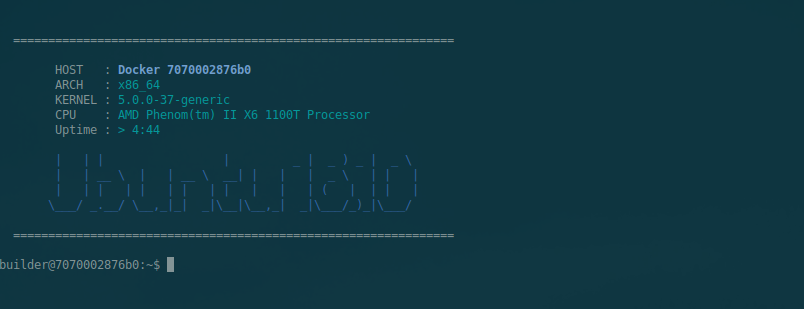](http://images.awspros.world/xlines/deb-install-0.png)

2. Download and install the repository definition file

    ```
    $ sudo apt install wget
    ```

    ```
    $ wget http://awscloud.center/deb/debian-tools.list
    ```

    [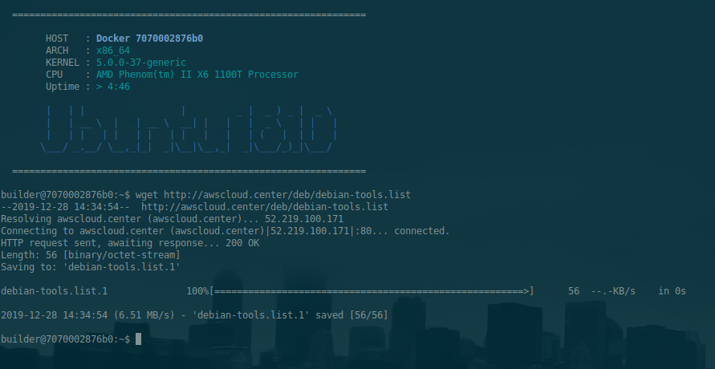](http://images.awspros.world/xlines/deb-install-1.png)

    ```
    $ sudo chown 0:0 debian-tools.list && sudo mv debian-tools.list /etc/apt/sources.list.d/
    ```

3. Install the package repository public key on your local machine

    ```
    $ wget -qO - http://awscloud.center/keys/public.key | sudo apt-key add -
    ```

    [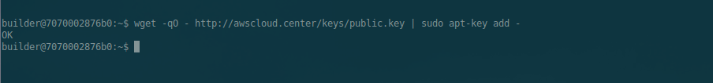](http://images.awspros.world/xlines/deb-install-2.png)

4. Update the local package repository cache

    ```
    $ sudo apt update
    ```

5. Install **xlines** os package

    ```
    $ sudo apt install python3-xlines
    ```

    Answer "y":

    [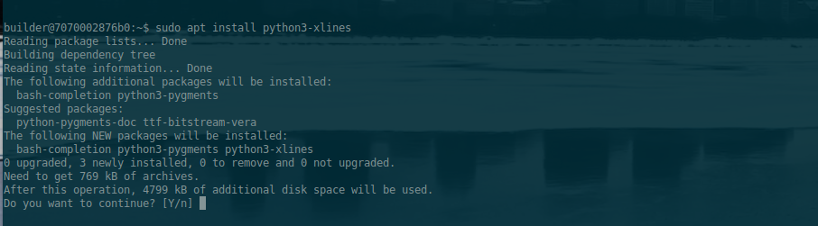](http://images.awspros.world/xlines/deb-install-3.png)


6. Verify Installation

    ```
    $ apt show python3-xlines
    ```

    [](http://images.awspros.world/xlines/rpm-install-4.png)


[back to the top](#top)

* * *
<a name="redhat-distro-install"></a>
### Redhat, CentOS  (Python 3.6)

The easiest way to install **xlines** on redhat-based Linux distributions is via the developer-tools package repository:


1. Open a command line terminal.

    [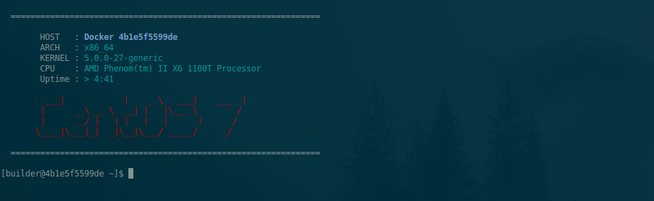](http://images.awspros.world/xlines/rpm-install-0.png)

2. Install the official epel package repository

    ```
    $ sudo yum install epel-release
    ```

2. Download and install the repo definition file

    ```
    $ sudo yum install wget
    ```

    [](http://images.awspros.world/xlines/rpm-install-1.png)

    ```
    $ wget http://awscloud.center/rpm/developer-tools.repo
    ```

    [](http://images.awspros.world/xlines/rpm-install-2.png)

    ```
    $ sudo chown 0:0 developer-tools.repo && sudo mv developer-tools.repo /etc/yum.repos.d/
    ```

3. Delete the local repository cache, then Update the cache with new package references

    ```
    $ sudo rm -fr /var/cache/yum
    $ sudo yum update -y
    ```

4. Install the **python3-xlines** os package

    ```
    $ sudo yum install python36-xlines
    ```

    [](http://images.awspros.world/xlines/rpm-install-3.png)


    Answer "y":

    [](http://images.awspros.world/xlines/rpm-install-4.png)


5. Verify Installation

    ```
    $ yum info python36-xlines
    ```

    [](http://images.awspros.world/xlines/rpm-install-5.png)


[back to the top](#top)

* * *
<a name="amzn2-distro-install"></a>
### Amazon Linux 2 / Fedora (Python 3.7)

The easiest way to install **xlines** on redhat-based Linux distribution [Amazon Linux 2](https://aws.amazon.com/amazon-linux-2) or [Fedora](http://fedoraproject.org), is via the developer-tools [amzn2.awscloud.center](http://amzn2.awscloud.center) package repository:


1. Install the official epel package repository

    ```
    $ sudo amazon-linux-extras install epel -y
    ```


2. Download and install the repo definition file

    ```
    $ sudo yum install wget
    ```

    [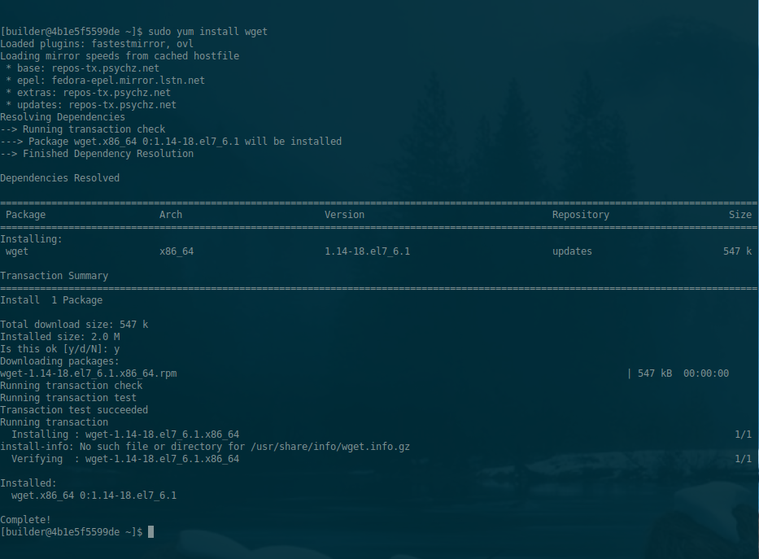](http://images.awspros.world/xlines/amzn2-install-1.png)

    ```
    $ wget http://awscloud.center/amzn2/developer-tools.repo
    ```

    [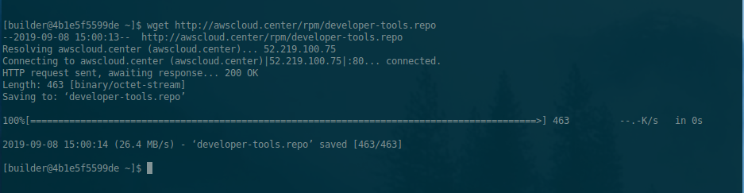](http://images.awspros.world/xlines/amzn2-install-2.png)

    ```
    $ sudo chown 0:0 developer-tools.repo && sudo mv developer-tools.repo /etc/yum.repos.d/
    ```

3. Delete the local repository cache, then Update the cache with new package references

    ```
    $ sudo rm -fr /var/cache/yum
    $ sudo yum update -y
    ```

4. Install **xlines** os package

    ```
    $ sudo yum install python37-xlines
    ```

    [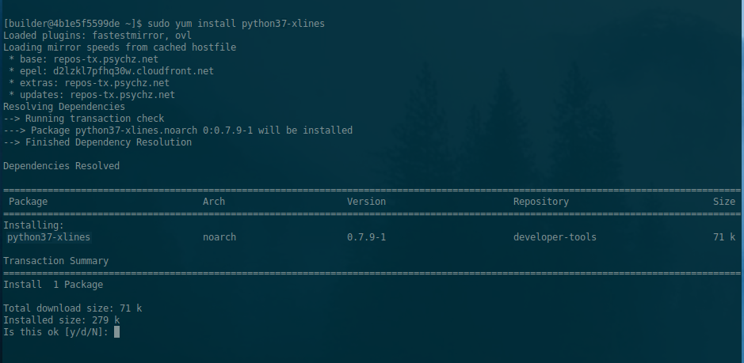](http://images.awspros.world/xlines/amzn2-install-3.png)


    Answer "y":

    [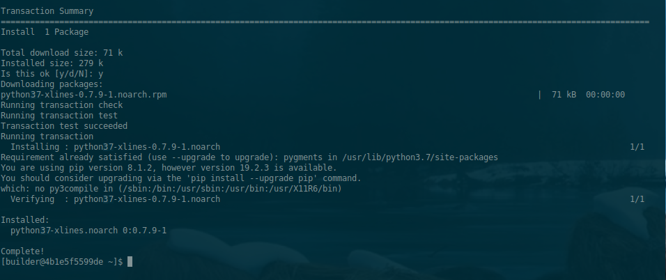](http://images.awspros.world/xlines/amzn2-install-4.png)


5. Verify Installation

    ```
    $ yum info python37-xlines
    ```

    [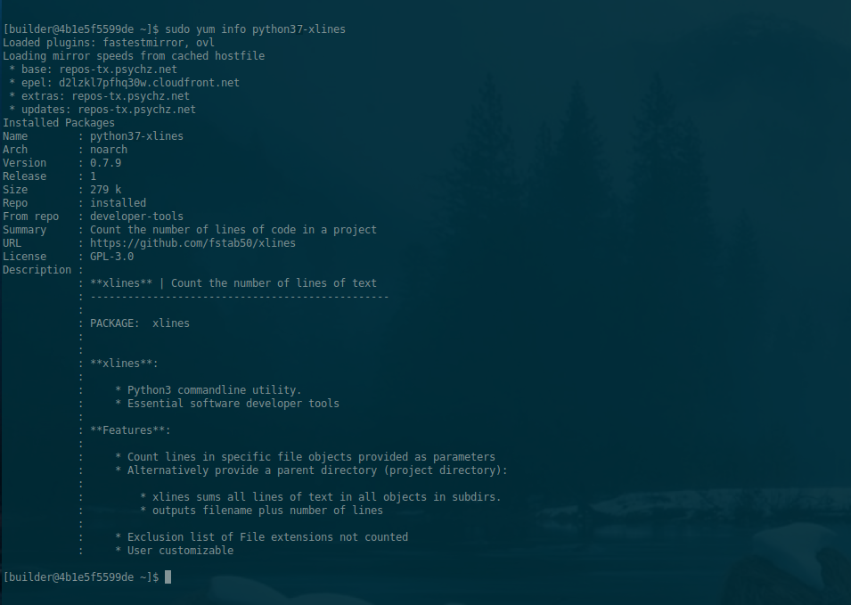](http://images.awspros.world/xlines/amzn2-install-5.png)

    A check of python3 should point to Python 3.7:
    ```
    $ python3 --version
    ```
    ```
    $ Python 3.7.X
    ```

--

[back to the top](#top)

* * *
## Screenshots

#### Project 1: Line count, low complexity git repository:

```bash
    $ xlines  --sum  git/branchdiff
```

<p align="center">
    <a href="http://images.awspros.world/xlines/xlines-output-branchdiff.png">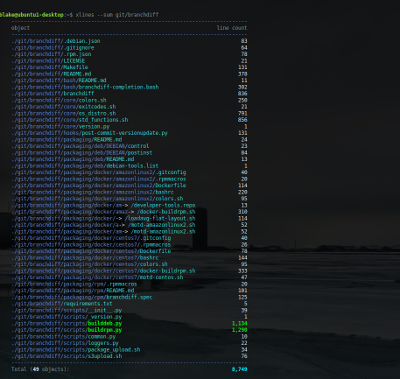
</p>


[back to the top](#top)

* * *

#### Project 2: Line count, medium complexity git repository:

<p align="right">
    <a href="http://images.awspros.world/xlines/xlines-awslabs.png">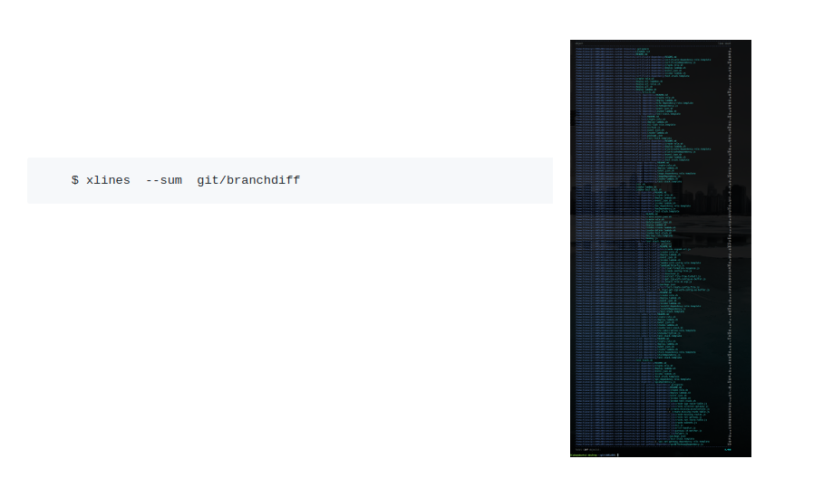
</p>


[back to the top](#top)

* * *

#### Project 3: Line count, high complexity git repository:

<p align="right">
    <a href="http://images.awspros.world/xlines/xlines_output_large.png">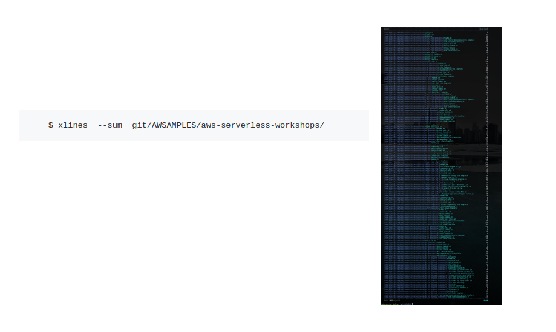
</p>


[back to the top](#top)

* * *

## Author & Copyright

All works contained herein copyrighted via below author unless work is explicitly noted by an alternate author.

* Copyright Blake Huber, All Rights Reserved.

[back to the top](#top)

* * *

## License

* Software contained in this repo is licensed under the [license agreement](./LICENSE.md).  You may display the license and copyright information by issuing the following command:

```
$ xlines --version
```

[](https://s3.us-east-2.amazonaws.com/http-imagestore/xlines/version-copyright.png)


[back to the top](#top)

* * *

## Disclaimer

*Code is provided "as is". No liability is assumed by either the code's originating author nor this repo's owner for their use at AWS or any other facility. Furthermore, running function code at AWS may incur monetary charges; in some cases, charges may be substantial. Charges are the sole responsibility of the account holder executing code obtained from this library.*

Additional terms may be found in the complete [license agreement](./LICENSE.md).

[back to the top](#top)

* * *
